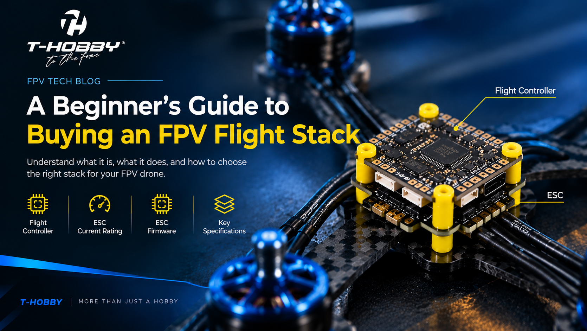
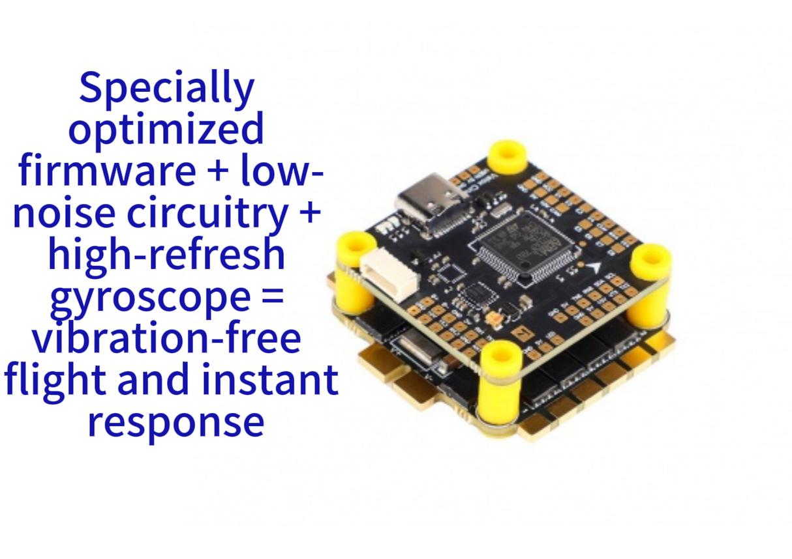
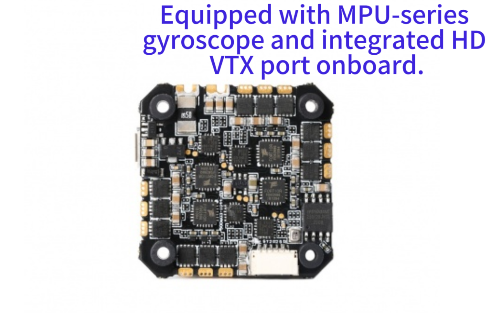
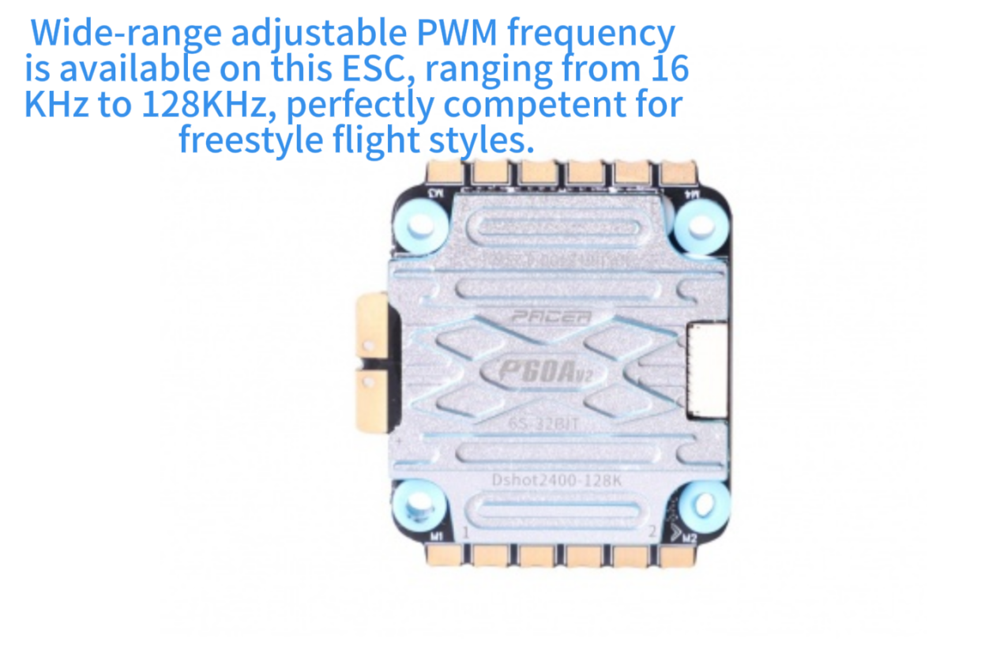
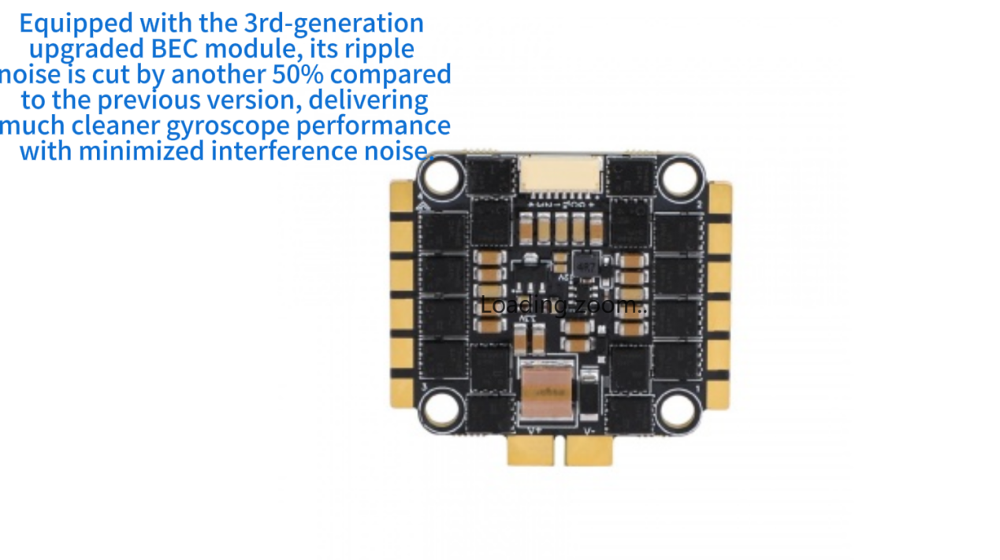

# A Beginner’s Guide to Buying an FPV Flight Stack

Before choosing a flight stack, it is important to understand what it is, what it does, and how it fits into an FPV drone’s overall power system.

## 1. What Is a Flight Stack?

A flight stack is a combination of a flight controller (FC) and an electronic speed controller (ESC), usually designed to be mounted together in a stacked configuration.

The flight controller is the “brain” of the FPV drone. It processes sensor data, especially gyro data, and runs flight-control algorithms to determine how the motors should respond. The ESC receives these control signals and regulates motor speed accordingly.

In the past, flight controllers and ESCs were often purchased separately. Today, many manufacturers offer matched FC-and-ESC stack kits, which can simplify compatibility, wiring, installation, and after-sales support.

A flight stack generally consists of:

- **Flight Controller (FC):** Processes sensor data and controls the drone’s flight.
- **Electronic Speed Controller (ESC):** Controls motor speed based on signals from the FC.

A video transmitter (VTX) is normally a separate component. Depending on the frame and build, it may be mounted alongside or above the flight stack.

Another option is an AIO (All-in-One) board, which integrates the flight controller and ESC into a single board. AIO boards are commonly used on smaller and lighter drones, such as 2–3-inch builds, while separate FC-and-ESC stacks are more common on larger 4-inch and 5-inch drones.

## 2. Understanding the Key Flight-Stack Specifications

The number of specifications can be overwhelming for beginners. The following are some of the most important factors to understand when choosing a flight stack.

### 2.1 Processor: F4, F7, or H7?

The processor, or MCU, is one of the most important components of a flight controller because it determines its processing capability and affects how many peripherals and features the board can support.

Here is a simple breakdown:

- **F4, such as the STM32F405:** Affordable and capable of handling many basic FPV builds, but with some hardware-resource limitations.
- **F7, such as the STM32F722:** Offers more processing headroom and greater peripheral flexibility, making it a good choice for many modern FPV builds.
- **H7, such as the STM32H743:** Provides significantly higher processing performance and is generally aimed at high-performance or feature-rich builds.

Clock speed is only one part of the equation. Available UARTs, peripheral resources, firmware support, gyro compatibility, and board design also matter.

For beginners, an F4 can be sufficient for a basic build. If your budget allows, an F7-based flight controller is often a more flexible and future-proof choice.

You do not need to choose an H7 simply because it has the highest specifications.

### 2.2 ESC Current Rating: How Many Amps Are Enough?### 2.2 ESC Current Rating: How Many Amps Are Enough?

The ESC current rating generally refers to the amount of current an ESC can handle for each motor channel under its specified operating conditions.

Choosing an ESC with too low a current rating can cause overheating or failure, while choosing an unnecessarily high-rated ESC may increase cost and weight without providing a meaningful benefit.

However, ESC current should not be selected based solely on drone size. The actual requirement depends on factors such as:

- Motor size and KV
- Propeller size and pitch
- Battery voltage
- Flying style
- Expected motor current
- Cooling conditions

For example, two 5-inch drones can have very different ESC requirements depending on their motors, propellers, and battery voltage.

For a typical 5-inch freestyle build, a 50–55A ESC can be a good starting point, but always check the motor and ESC manufacturer’s specifications before making a final choice.

When comparing ESCs, also pay attention to whether the advertised current rating refers to continuous current or burst current.

### 2.3 ESC Firmware: 8-bit or 32-bit?

ESCs can use different MCU architectures and firmware platforms.

Many older or budget BLHeli_S ESCs use 8-bit MCUs, while many modern ESCs use 32-bit MCUs and firmware such as BLHeli_32 or AM32.

Some compatible 8-bit BLHeli_S ESCs can be flashed with Bluejay firmware, which can add features such as bidirectional DShot, RPM telemetry, and configurable PWM frequencies.

However, flashing Bluejay does not turn an 8-bit ESC into a 32-bit ESC. The underlying hardware remains an 8-bit MCU.

For a new build, choosing a modern ESC with suitable firmware support can provide greater flexibility. However, the actual flight performance depends on the ESC hardware, firmware, motor, and overall power-system design—not simply whether the ESC is 8-bit or 32-bit.

### 2.4 Voltage Range: Which Battery Sizes Are Supported?

The letter S indicates the number of lithium battery cells connected in series.

For example:

- **4S = 4 cells in series**
- **6S = 6 cells in series**

Both 4S and 6S are common choices for 5-inch FPV drones.

For beginners, 4S can provide a more manageable starting point, but 6S is also widely used and is not necessarily an “upgrade” that every pilot needs.

The correct battery depends on the motor KV, propeller, ESC, and overall power-system design.

For example, you should not simply switch from 4S to 6S without confirming that the motor and ESC are designed to handle the higher voltage.

When buying a flight stack, make sure its voltage rating supports the battery configuration you plan to use.

### 2.5 Gyroscope and Additional Features

The gyroscope is one of the key sensors used by the flight controller to detect the drone’s rotational movement and maintain stable flight.

The ICM-42688-P is currently a popular choice for new flight-controller designs. The MPU-6000 remains common on existing hardware, but it has reached end-of-life.

Some flight controllers also include Bluetooth or Wi-Fi connectivity for configuration and tuning. These features can allow pilots to make certain adjustments using a smartphone instead of connecting the drone to a computer, which can be particularly convenient for beginners.

## 3. Key Buying Principles for Beginners

### Principle 1: Choose the Drone Type First, Then Select the Flight Stack

First decide what type and size of drone you want to build.

A 5-inch freestyle drone is a common starting point because the platform is mature, replacement parts are widely available, and there are many tutorials and community resources.

Once you have selected the frame, check its flight-controller mounting pattern and the recommended stack dimensions.

Common mounting patterns include **30.5 × 30.5 mm** and **20 × 20 mm**, referring to the center-to-center distance between the mounting holes.

The mounting pattern of the flight stack must match the frame.

You should also make sure that the stack physically fits inside the frame and that there is enough space for the other components.

When in doubt, check the product specifications or ask the manufacturer or seller for advice.

### Principle 2: Beginners Don’t Need to Chase the Highest Specifications

Beginners do not necessarily need the most powerful processor or highest-rated ESC.

An F4 flight controller can be sufficient for a basic build, while an F7 provides additional flexibility if your budget allows.

The same principle applies to the ESC. Instead of simply choosing the highest current rating available, select an ESC that is appropriately matched to your motor, propeller, and battery combination.

The goal is to choose a well-matched power system, not simply the highest specifications.

### Principle 3: Choose a Matched Stack from the Same Brand When Possible

Buying the FC and ESC separately gives you more freedom, but it may require more attention to compatibility, wiring, mounting, and firmware.

Choosing a matched FC-and-ESC stack from the same brand can simplify:

- Compatibility
- Wiring
- Installation
- Firmware configuration
- Technical support

However, products from different manufacturers can also work together when their specifications and interfaces are compatible.

### Principle 4: Pay Attention to the Pad Layout

A well-designed solder-pad layout can make wiring much easier, especially for first-time builders.

For example, camera pads positioned toward the front of the board can make it easier to route camera wires forward, while receiver and VTX connections positioned toward the rear can simplify rearward cable routing.

A practical pad layout can reduce wiring complexity and make maintenance easier.

Also check the board’s UART count and peripheral layout to make sure it supports the devices you plan to connect.

## 4. Common Mistakes and How to Avoid Them

### Mistake 1: Assuming Higher Specifications Are Always Better

An H7 processor or a 100A ESC may look impressive, but beginners generally do not need that level of hardware for a typical 5-inch build.

Higher specifications can also increase cost without providing a noticeable benefit for your particular setup.

For many beginners, an F4 or F7 flight controller paired with an appropriately rated ESC is more than enough.

The best choice is the one that matches your actual build.

### Mistake 2: Choosing an Unknown Brand Just to Save Money

The cheapest flight stack is not always the best value.

Products from less-established manufacturers may offer limited firmware support, documentation, quality control, or after-sales service.

When choosing a flight stack, consider the manufacturer’s reputation, firmware compatibility, product documentation, warranty, and technical support—not just the purchase price.

### Mistake 3: Underestimating the Budget for Supporting Equipment

The flight stack is only one part of an FPV drone.

A complete FPV setup may also require:

- Frame
- Motors
- Propellers
- Radio controller
- FPV goggles
- VTX
- Batteries
- Battery charger

The total cost can be significantly higher than the cost of the flight stack alone.

Before buying your first flight stack, plan your budget for the entire FPV setup rather than focusing only on the FC and ESC.

### Mistake 4: Flying a Real Drone Without Practicing on a Simulator

FPV drones require active manual control, especially when flying in Acro mode.

Before flying a real drone, beginners should spend sufficient time practicing on an FPV simulator.

There is no universal number of hours that guarantees safe flying. Some pilots may need more practice than others.

Simulator training can help beginners learn basic throttle control, turning, orientation, and recovery techniques while reducing the risk of damaging their real drone.

When you are ready for your first real flight, choose a suitable open area and follow all applicable local safety requirements.

## 5. Final Recommendations for Beginners

### 1. Drone Type

Start with a 5-inch freestyle drone if you want a versatile and well-supported platform. Replacement parts are widely available, and there are plenty of tutorials and community resources.

### 2. Flight-Stack Configuration

For a typical beginner 5-inch build, an F405 or F722 flight controller paired with a 50–55A ESC can provide a good balance of performance and value.

Choose the ESC based on your specific motor, propeller, and battery combination rather than the drone size alone.

If your budget allows, an F722-based stack can provide more flexibility for future builds and additional peripherals.

### 3. Supporting Equipment

Remember to budget for the rest of the FPV setup, including the radio controller, goggles, VTX, batteries, charger, frame, motors, and propellers.

Practice on a simulator before flying your real drone.

### 4. Safety and Regulations

Drone regulations vary by country and region and can change over time.

Before flying, check the latest local requirements, including registration, airspace restrictions, Remote ID requirements, and other applicable rules.

Always fly responsibly and follow local regulations.

## Conclusion

The flight stack is one of the core electronic systems of an FPV drone. Choosing the right one is not about buying the highest specifications—it is about finding the right balance between compatibility, performance, reliability, and budget.

For beginners, start by choosing the drone size and power system you want to build. Then select an FC and ESC that match your frame, motors, propellers, and battery.

Once you understand these basic principles, choosing a flight stack becomes much easier.

**Choose what fits your build—not simply what has the biggest numbers.**
